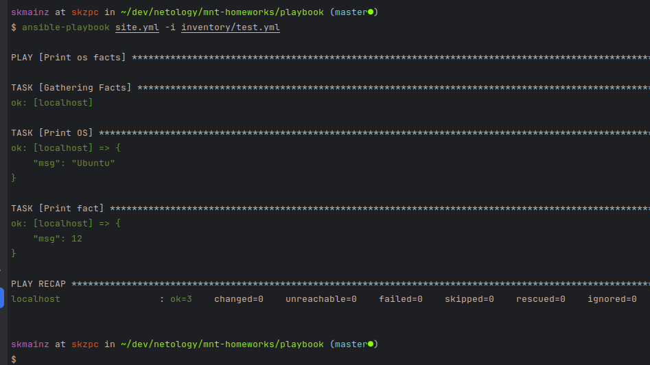
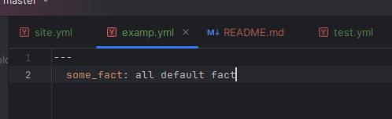
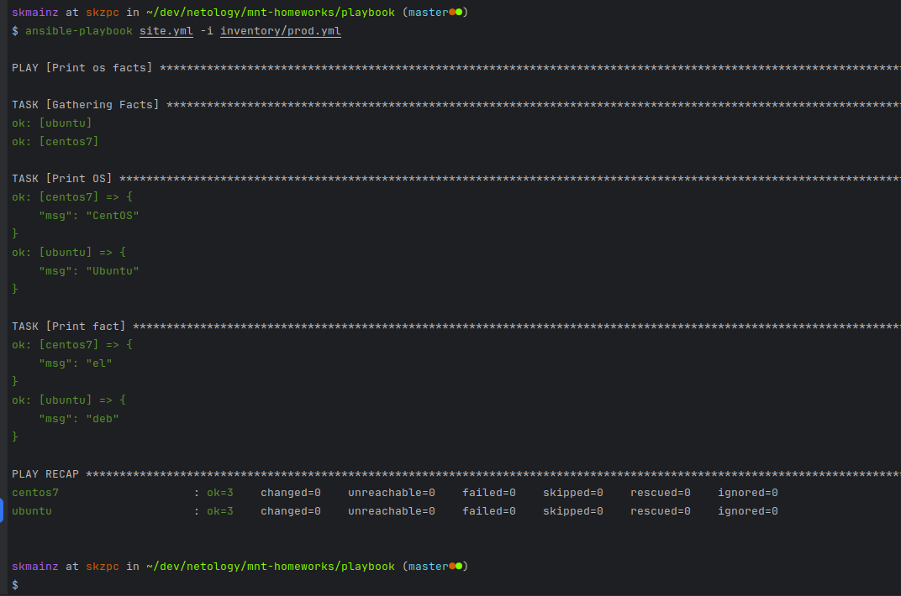
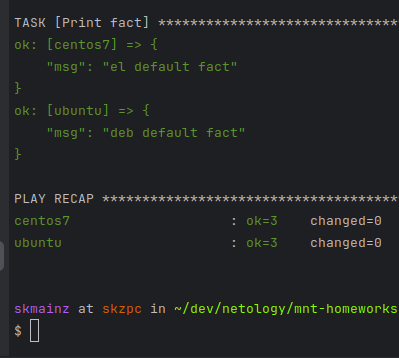
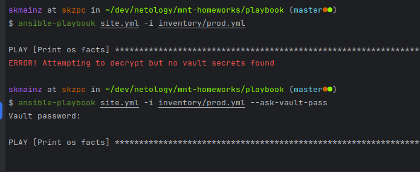
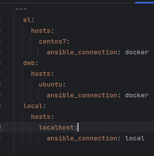
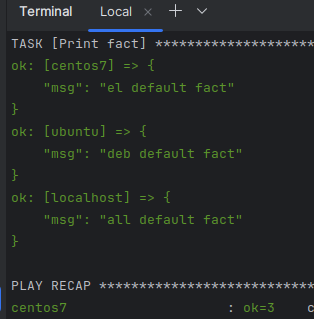

# Занятие 1: Введение в Ansible

## 1. 

Значение `some_fact` имеет значение 12.



## 2.

Файл `group_vars/all/examp.yml`



## 3,4

```
ok: [centos7] => {
"msg": "el"
}
ok: [ubuntu] => {
"msg": "deb"
}
```



## 5,6

В файлах `group_vars/deb/examp.yml` и `group_vars/el/exampl.yml`.



## 7

```
ansible-vault encrypt group_vars/deb/examp.yml    
```

```
ansible-vault encrypt group_vars/el/examp.yml
```

## 8.

```
ansible-playbook site.yml -i inventory/prod.yml --ask-vault-pass
```



## 9.

Команда `ansible-doc -t connection -l` выводит список плагинов для подключения к локальной ноде.

## 10.

```
  local:
    hosts:
      localhost:
        ansible_connection: local
```




